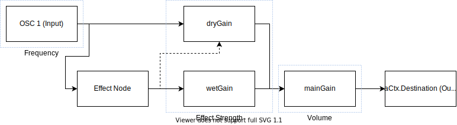

# Audio

This is a short overview of how the web audio portion of the app works and you can modify the resulting sound.

## Node Overview

The Web Audio API ([MDN](https://developer.mozilla.org/en-US/docs/Web/API/Web_Audio_API)) is a series of different audio nodes that can be connected together in different ways to create and/or modify sound. In this case, an Oscillator Node acts as the input and outputs a static frequency (440 hz by default). The Oscillator Node connects to both the Effect Node and the Dry Gain Node. The Effect Node in this system is interchangeable so it could be something simple like another Gain Node, a Delay Node or a Flanger Node to name a few. The effect node will sometimes also connect to the Wet Gain Node but this depends on the specific effect. The Wet Gain Node and Dry Gain Node work in tandem to control the effect strength. Finally, both the Wet Gain and Dry Gain nodes connect to the Main Gain Node which is controls the volume of the Output, the Main Gain Node connects to the Audio Context Destination which will output audio to the user's speakers.

In the diagram above, anything outlined in blue signifies something that the user can change, so in the case of the Oscillator Node it's the frequency, the Dry and Wet Gain Nodes it's the effect strength and the Main Gain Node it's the output volume.

## Web Audio in Code

In this project, most of the Web Audio stuff is found in `client/src/features/audio/Audio.tsx` in the `useEffect` function. Some additional effect nodes are included in `client/src/audio/effectNodes.ts`.

One important thing to note here is that generally, Web Audio nodes are coded in reverse so you start with the Main Gain Node which connects to the output (generally referred to in code as `audioContext.destination`) and then move on to the Wet Gain Node and Dry Gain Node which both connect to the Main Gain node and so on.

## Adding Different Effects

Adding or changing effects is quite straight forward, simply replace the existing Delay Node with something else (see `client/src/audio/effectNodes.ts`) for examples. You could also add additional effect nodes by connecting them either before or after the Delay Node, just be sure to update any connection or disconnection calls to keep everything linked together.
